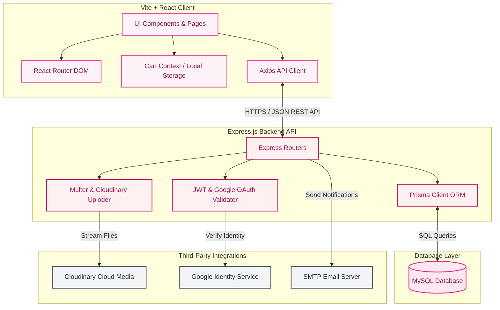

# 🌸 Presento — Premium Full-Stack E-Commerce Platform

Presento is a state-of-the-art, fully featured full-stack e-commerce marketplace designed with premium aesthetics. It incorporates **glassmorphism design concepts**, smooth **micro-animations (Framer Motion)**, and a highly polished dark-pink color palette (Playfair Display & Inter typography). 

Behind its gorgeous front-end lies a robust production-ready API built with Express, Prisma, and MySQL, integrating Cloudinary for media uploads, Google OAuth for authentication, and Nodemailer for transactional email triggers.

---

## 🚀 Key Features

### 🛍️ User Experience
- **Interactive Product Catalog**: Grid layout of products with sorting, searching, badges (e.g., featured, sale), and interactive category selection.
- **Dynamic Shopping Cart**: Real-time calculations, item counters, custom states, and smooth slide-in updates.
- **Saved Address Book**: Multi-address support allowing users to save, modify, or choose addresses during checkout.
- **Secure Checkout & Order Management**: Clean payment mock interface with complete cart-to-order processing, order history, and tracking.
- **Media-Rich Product Reviews**: Customers can leave ratings and comments, and upload **photos and videos** to express their feedback. Includes an overlay lightbox to view media files.
- **AI Assistant**: Conversational assistant interface ready to answer questions about products and recommend items.

### 🔐 Security & Identity
- **Dual-Method Auth**: Standard credentials login/signup alongside one-click **Google OAuth 2.0 Integration**.
- **Role-Based Access**: Secure admin routes protected via middleware. Regular users can manage their profiles and orders while admins have complete oversight.
- **Admin Dashboard**: Comprehensive CRUD dashboard to add products, modify specifications (SKU, discount, stock, descriptions), upload product media, and delete listings.

### ⚙️ Backend Architecture
- **Prisma ORM & MySQL**: Strongly typed database schema with structured relationships between Users, Addresses, Products, Orders, OrderItems, and Reviews.
- **Media Storage via Cloudinary**: Seamless integration with Multer to upload product images and review photos/videos to the cloud.
- **Transactional Email Triggers**: Automatic order confirmation and notifications sent via Nodemailer.

---

## 📊 System Architecture



---

## 📁 Directory Structure

```
fullstack_presento/
├── admin-helper.html         # Local helper utility to mock admin credentials in localStorage
├── backend/                  # Server-side Application
│   ├── index.js              # Entrypoint server script
│   ├── prisma/
│   │   └── schema.prisma     # Prisma database schema definition (User, Product, Order, Review)
│   ├── routes/               # API endpoint definitions (auth, product, order, address, review)
│   ├── middleware/           # Auth verification middleware
│   ├── utils/                # Helper utilities (Cloudinary, Multer configs, nodemailer sendEmail)
│   └── scripts/              # Helper utility scripts
└── frontend/                 # Client-side React Application
    ├── index.html            # Main HTML entrypoint
    ├── src/
    │   ├── App.jsx           # Client router and route definitions
    │   ├── main.jsx          # App bootstrap logic
    │   ├── index.css         # Main custom styling & layout tokens
    │   ├── components/       # Reusable components (Navbar, FAQ, ReviewList, SearchBar, Lightbox)
    │   ├── pages/            # App view screens (Home, Products, Chat, Checkout, Cart)
    │   ├── context/          # Context providers (Cart state management)
    │   └── styles/           # Layout-specific CSS files
    └── vite.config.js        # Vite bundler configuration
```

---

## 🧪 Technologies Used
- **Frontend Core**: React 19, React Router DOM v7, Axios, Framer Motion, Vanilla CSS (Custom tokens with variables)
- **Tooling**: Vite, ESLint
- **Backend API**: Node.js, Express.js (v5)
- **Database Access**: Prisma Client, Prisma CLI
- **Identity & Mail**: jsonwebtoken, google-auth-library, bcryptjs, nodemailer, passport
- **Storage & Uploads**: Multer, Cloudinary SDK
